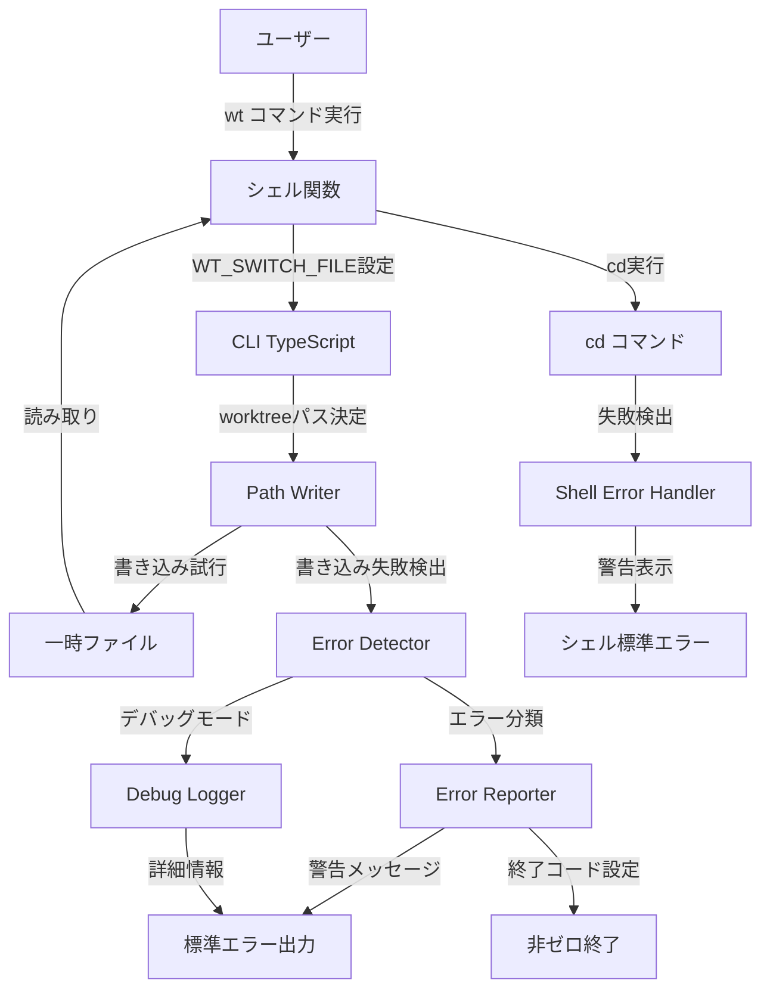
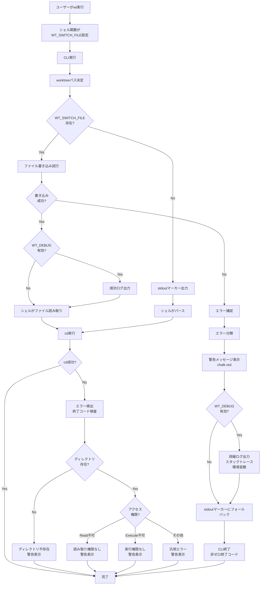

# Technical Design Document

## Overview

本機能は、wtコマンドを使用してworktreeへのディレクトリ変更を試みた際、cd操作が失敗した場合にユーザーへの適切なフィードバックを提供する。cd失敗の検出と原因の特定を行い、明確な警告メッセージを表示することで、ユーザーがディレクトリ移動の問題を迅速に把握し、問題解決を容易にする。

**Purpose:** wtコマンド使用時のcd操作失敗を検出し、ユーザーに即座にフィードバックを提供することで、トラブルシューティングの効率化とユーザーエクスペリエンスの向上を実現する。

**Users:** wtコマンドの全ユーザー（開発者、システム管理者）が、worktreeへのディレクトリ変更時にこの機能の恩恵を受ける。

**Impact:** 既存のシェル統合メカニズム（環境変数メソッドとstdoutマーカーメソッド）を拡張し、cd失敗検出とエラーレポート機能を追加する。既存の正常系フローには影響を与えず、エラーパスのみを強化する。

### Goals

- cd操作失敗時の即座の検出と通知
- 失敗原因の明確な提示（ディレクトリ不存在、アクセス権限エラーなど）
- 環境変数メソッドとstdoutマーカーメソッドの両方でのエラーハンドリング
- デバッグモードでの詳細情報提供

### Non-Goals

- cd操作の自動リトライ機能
- ディレクトリの自動作成や修復機能
- シェル統合以外のcd失敗検出（例: プログラム内でのprocess.chdir()の失敗検出）
- 他のコマンド（add, remove, pruneなど）のエラーハンドリング改善

## Architecture

### Existing Architecture Analysis

wtコマンドは現在、以下のシェル統合アーキテクチャを採用している：

**環境変数メソッド（推奨）:**
1. シェル関数が一時ファイルパス（`WT_SWITCH_FILE`）を環境変数として設定
2. CLI（TypeScript）がworktreeパスを一時ファイルに書き込み
3. シェル関数が一時ファイルを読み取り、`cd`コマンドを実行
4. 一時ファイルを削除

**stdoutマーカーメソッド（フォールバック）:**
1. CLI（TypeScript）が`WT_CD:<path>`形式でstdoutに出力
2. シェル関数が正規表現でパスを抽出し、`cd`コマンドを実行

**既存の制約:**
- cd操作はシェル関数側で実行されるため、CLI側では成否を直接把握できない
- 環境変数メソッドのファイル書き込み失敗は検出できるが、シェル側のcd失敗は検出できない
- stdoutマーカーメソッドでは、CLI側はパスを出力するだけで、cd実行結果は不明

**保持すべきパターン:**
- 2段階フォールバックメカニズム
- CLI側とシェル側の責任分離（CLI: パス決定、シェル: cd実行）
- 一時ファイルの自動クリーンアップ

### High-Level Architecture



### Technology Alignment

本機能は既存のwtコマンドの技術スタックを維持し、拡張する形で実装する：

**CLI側（TypeScript）:**
- **既存**: Node.js, TypeScript, chalk（カラー出力）, fs（ファイルシステム操作）
- **追加**: なし（既存モジュールのみ使用）

**シェル側（zsh）:**
- **既存**: zsh関数、環境変数、一時ファイル操作
- **追加**: cdコマンドの終了コード検査、条件分岐によるエラーハンドリング

**新規依存関係:**
なし。既存のNode.js標準ライブラリとchalkライブラリのみで実装可能。

**既存パターンからの逸脱:**
なし。既存のエラーハンドリングパターン（chalk.redでのエラー表示、process.exit()での終了コード設定）を踏襲する。

## Key Design Decisions

### Decision 1: CLI側とシェル側での二重エラーハンドリング

**Context:** cd操作はシェル関数内で実行されるため、CLI側では直接的にcd成否を検出できない。しかし、環境変数メソッドにおけるファイル書き込み失敗は、CLI側で検出可能である。

**Alternatives:**
1. **CLI側のみでエラーハンドリング**: ファイル書き込み失敗のみ検出、cd失敗は検出不可
2. **シェル側のみでエラーハンドリング**: cd失敗は検出可能、ファイル書き込み失敗は検出不可
3. **両側でエラーハンドリング**: ファイル書き込み失敗とcd失敗の両方を検出

**Selected Approach:**
両側でエラーハンドリング（Option 3）を採用する。

- **CLI側**: `writeCdPath()`メソッド内で、`writeFileSync()`のtry-catchブロックによりファイル書き込み失敗を検出し、警告メッセージを表示する
- **シェル側**: `cd`コマンドの終了コード（`$?`）を検査し、cd失敗時に警告メッセージを表示する

**Rationale:**
- **完全性**: ファイル書き込み失敗（パーミッションエラー、ディスク容量不足など）とcd失敗（ディレクトリ不存在、アクセス権限エラーなど）の両方をカバー
- **ユーザーエクスペリエンス**: どちらのエラーパスでもユーザーに適切なフィードバックを提供
- **既存設計との整合性**: CLI側とシェル側の責任分離を維持しつつ、各層で検出可能なエラーを処理

**Trade-offs:**
- **利点**: 全エラーケースを網羅、即座のフィードバック
- **欠点**: エラーハンドリングロジックが2箇所に分散（保守性への軽微な影響）

### Decision 2: エラー原因の詳細分類とメッセージング

**Context:** cd失敗には複数の原因（ディレクトリ不存在、アクセス権限エラー、パス形式エラーなど）が存在し、ユーザーが問題を自己解決するには原因の特定が重要である。

**Alternatives:**
1. **汎用エラーメッセージ**: 全エラーに対して「cd failed」のみ表示
2. **簡易分類**: 存在チェックのみ実施（存在する/しない）
3. **詳細分類**: ファイルシステムAPIを使用して原因を特定

**Selected Approach:**
詳細分類（Option 3）を採用する。

**CLI側でのファイル書き込み失敗検出:**
```typescript
try {
  writeFileSync(switchFile, path);
} catch (error) {
  const errorMessage = error instanceof Error ? error.message : String(error);
  console.error(chalk.red(`⚠️  Failed to write switch file: ${errorMessage}`));
  console.error(chalk.red(`Target directory: ${path}`));
  // フォールバック: stdoutマーカーメソッド
  console.log(`WT_CD:${path}`);
}
```

**シェル側でのcd失敗検出:**
```zsh
if ! cd "$new_dir" 2>/dev/null; then
  if [[ ! -d "$new_dir" ]]; then
    echo "⚠️  Directory does not exist: $new_dir" >&2
  elif [[ ! -r "$new_dir" ]]; then
    echo "⚠️  No read permission for directory: $new_dir" >&2
  elif [[ ! -x "$new_dir" ]]; then
    echo "⚠️  No execute permission for directory: $new_dir" >&2
  else
    echo "⚠️  Failed to change directory: $new_dir" >&2
  fi
fi
```

**Rationale:**
- **自己解決の促進**: ユーザーが原因を特定し、適切な対処（パーミッション修正、ディレクトリ作成など）を実施可能
- **デバッグ効率**: 開発者やシステム管理者が問題を迅速に診断可能
- **実装コスト**: 標準的なファイルシステムチェック（`-d`, `-r`, `-x`）を使用するため、実装は簡潔

**Trade-offs:**
- **利点**: 明確なエラー原因の提示、トラブルシューティング時間の短縮
- **欠点**: シェル側のロジックが若干複雑化（条件分岐の増加）

### Decision 3: デバッグモードの実装方式

**Context:** 開発者がcd失敗を詳細に調査する際、システム状態（環境変数、ファイル存在確認結果など）の詳細情報が必要である。

**Alternatives:**
1. **環境変数ベース**: `WT_DEBUG=true`で詳細ログを有効化
2. **コマンドラインフラグ**: `wt --debug`で詳細ログを有効化
3. **ログファイル**: 常にログファイルに記録、必要時に参照

**Selected Approach:**
環境変数ベース（Option 1）を採用する。

**実装:**
```typescript
private writeCdPath(path: string): void {
  const switchFile = process.env.WT_SWITCH_FILE;
  const debugMode = process.env.WT_DEBUG === 'true';

  if (switchFile) {
    try {
      writeFileSync(switchFile, path);
      if (debugMode) {
        console.error(chalk.gray(`[DEBUG] Successfully wrote to switch file: ${switchFile}`));
        console.error(chalk.gray(`[DEBUG] Target path: ${path}`));
      }
    } catch (error) {
      console.error(chalk.red(`⚠️  Failed to write switch file: ${error instanceof Error ? error.message : error}`));
      console.error(chalk.red(`Target directory: ${path}`));

      if (debugMode) {
        console.error(chalk.gray(`[DEBUG] Switch file: ${switchFile}`));
        console.error(chalk.gray(`[DEBUG] File system error:`, error));
        console.error(chalk.gray(`[DEBUG] Environment: WT_SWITCH_FILE=${switchFile}`));
      }

      // フォールバック
      console.log(`WT_CD:${path}`);
    }
  } else {
    console.log(`WT_CD:${path}`);
    if (debugMode) {
      console.error(chalk.gray(`[DEBUG] Using stdout marker method (WT_SWITCH_FILE not set)`));
    }
  }
}
```

**Rationale:**
- **セッション単位での制御**: 特定のセッションでのみデバッグモードを有効化可能（`WT_DEBUG=true wt`）
- **グローバル設定との併用**: `export WT_DEBUG=true`で全コマンドに適用も可能
- **既存パターンとの一貫性**: `WT_SWITCH_FILE`など、既に環境変数を使用している

**Trade-offs:**
- **利点**: シンプルな有効化、セッションレベルの柔軟性
- **欠点**: フラグと比較して若干の煩雑さ（環境変数の設定が必要）

## System Flows

### cd失敗検出フロー



## Requirements Traceability

| Requirement | Components | Interfaces | Flows |
|-------------|------------|------------|-------|
| 1.1 - cd失敗検出 | CLI Error Detector, Shell Error Handler | `writeCdPath()`, シェルcd終了コード検査 | cd失敗検出フロー |
| 1.2 - 警告メッセージ表示 | Error Reporter | `console.error(chalk.red())` | cd失敗検出フロー |
| 1.3 - ディレクトリパス表示 | Error Reporter | エラーメッセージ内に`${path}`を含む | cd失敗検出フロー |
| 1.4 - 赤色ハイライト | Error Reporter | `chalk.red()` | cd失敗検出フロー |
| 2.1 - ディレクトリ不存在通知 | Shell Error Handler | `[[ ! -d "$new_dir" ]]` 検査 | cd失敗検出フロー（CheckDir分岐） |
| 2.2 - アクセス権限エラー通知 | Shell Error Handler | `[[ ! -r "$new_dir" ]]`, `[[ ! -x "$new_dir" ]]` 検査 | cd失敗検出フロー（CheckPerm分岐） |
| 2.3 - 汎用エラーメッセージ | Shell Error Handler | その他のエラー分岐 | cd失敗検出フロー（ErrGeneric） |
| 3.1 - WT_SWITCH_FILEでの失敗検出 | CLI Error Detector | `writeFileSync()` try-catch | cd失敗検出フロー（WriteFile分岐） |
| 3.2 - 書き込み失敗警告 | Error Reporter | catch節でのエラー表示 | cd失敗検出フロー（CatchError分岐） |
| 3.3 - stdoutマーカーでのガイダンス | Shell Error Handler | シェル関数内のcd失敗ハンドリング | cd失敗検出フロー（ShellCD分岐） |
| 3.4 - シェル統合スクリプトでの警告 | Shell Error Handler | シェル関数のcd失敗検出 | cd失敗検出フロー（ShellErrorDetect） |
| 4.1 - 非ゼロ終了コード | Error Reporter | `process.exit(1)` または既存の終了 | cd失敗検出フロー（CLIExit） |
| 4.2 - 元のディレクトリに留まる | Shell Error Handler | cd失敗時はディレクトリ変更なし | cd失敗検出フロー（CDSuccess No分岐） |
| 4.3 - プロセスクラッシュ防止 | Error Detector, Shell Error Handler | try-catch、条件分岐 | cd失敗検出フロー全体 |
| 5.1 - デバッグスタックトレース | Debug Logger | `WT_DEBUG`環境変数によるログ出力 | cd失敗検出フロー（DebugLog分岐） |
| 5.2 - システム状態ログ | Debug Logger | 環境変数、ファイル存在確認結果の出力 | cd失敗検出フロー（DetailedLog） |
| 5.3 - WT_DEBUG拡張情報 | Debug Logger | `process.env.WT_DEBUG === 'true'` 検査 | cd失敗検出フロー（DebugLog分岐） |

## Components and Interfaces

### CLI Layer

#### Error Detector

**Responsibility & Boundaries**
- **Primary Responsibility**: CLI側でのファイル書き込み失敗検出
- **Domain Boundary**: CLI実行コンテキスト（TypeScript）
- **Data Ownership**: 一時ファイルへの書き込み成否状態
- **Transaction Boundary**: 単一のファイル書き込み操作

**Dependencies**
- **Inbound**: `WorktreeManager`の`writeCdPath()`メソッドから呼び出される
- **Outbound**: Error Reporter（エラーメッセージ表示）、Debug Logger（デバッグ情報出力）
- **External**: Node.js `fs.writeFileSync()`、chalk

**Contract Definition**

```typescript
interface ErrorDetectorService {
  /**
   * ディレクトリパスを一時ファイルまたはstdoutに書き込む
   * 書き込み失敗時はエラー検出とレポートを実施
   *
   * @param path - 移動先のディレクトリパス
   * @throws なし（エラーは内部でハンドリング）
   */
  writeCdPath(path: string): void;
}
```

**Preconditions:**
- `path`は有効なworktreeパス文字列である
- `process.env.WT_SWITCH_FILE`は存在するか、未定義（フォールバック）

**Postconditions:**
- 成功時: 一時ファイルに`path`が書き込まれる、またはstdoutに`WT_CD:<path>`が出力される
- 失敗時: 標準エラー出力に警告メッセージが表示され、stdoutマーカーにフォールバックする

**Invariants:**
- いかなるエラーでもプロセスはクラッシュしない
- 必ずシェル側に何らかの形でパス情報を渡す（ファイルまたはstdout）

**Integration Strategy:**
- **Modification Approach**: 既存の`writeCdPath()`メソッドを拡張（try-catchブロックとデバッグログの追加）
- **Backward Compatibility**: 既存の動作（正常系）は変更なし、エラーパスのみ強化
- **Migration Path**: 段階的な拡張。まずCLI側のエラー検出を実装し、その後シェル側のエラーハンドリングを追加

#### Error Reporter

**Responsibility & Boundaries**
- **Primary Responsibility**: エラーメッセージのフォーマットと出力
- **Domain Boundary**: CLI実行コンテキスト（TypeScript）
- **Data Ownership**: エラーメッセージの内容と形式
- **Transaction Boundary**: 単一のエラーメッセージ出力操作

**Dependencies**
- **Inbound**: Error Detector（ファイル書き込み失敗時）
- **Outbound**: 標準エラー出力（`console.error`）
- **External**: chalk

**Contract Definition**

```typescript
interface ErrorReporterService {
  /**
   * ファイル書き込み失敗のエラーメッセージを表示
   *
   * @param error - エラーオブジェクトまたはメッセージ
   * @param path - 対象ディレクトリパス
   * @param switchFile - 一時ファイルパス（オプション、デバッグ用）
   */
  reportWriteFailure(
    error: Error | string,
    path: string,
    switchFile?: string
  ): void;
}
```

**Preconditions:**
- `error`は有効なErrorオブジェクトまたは文字列である
- `path`は有効なディレクトリパス文字列である

**Postconditions:**
- 標準エラー出力に赤色の警告メッセージが表示される
- デバッグモード有効時は追加の詳細情報が表示される

**Invariants:**
- メッセージは必ず`chalk.red()`で装飾される
- ターゲットパスは必ずメッセージに含まれる

#### Debug Logger

**Responsibility & Boundaries**
- **Primary Responsibility**: デバッグモード有効時の詳細情報出力
- **Domain Boundary**: CLI実行コンテキスト（TypeScript）
- **Data Ownership**: デバッグログの内容
- **Transaction Boundary**: 単一のログ出力操作

**Dependencies**
- **Inbound**: Error Detector（デバッグ情報出力要求）
- **Outbound**: 標準エラー出力（`console.error`）
- **External**: chalk、process.env

**Contract Definition**

```typescript
interface DebugLoggerService {
  /**
   * デバッグモード有効時に詳細情報を出力
   *
   * @param context - ログコンテキスト（success, error, fallback）
   * @param details - 詳細情報オブジェクト
   */
  logDebugInfo(
    context: 'success' | 'error' | 'fallback',
    details: {
      path?: string;
      switchFile?: string;
      error?: Error | string;
      envVars?: Record<string, string | undefined>;
    }
  ): void;
}
```

**Preconditions:**
- `process.env.WT_DEBUG`が`'true'`である場合のみ実行される

**Postconditions:**
- 標準エラー出力にグレー色のデバッグ情報が表示される

**Invariants:**
- デバッグモード無効時は何も出力しない
- 通常のエラー表示を妨げない

### Shell Layer

#### Shell Error Handler

**Responsibility & Boundaries**
- **Primary Responsibility**: シェル関数内でのcd失敗検出とエラーメッセージ表示
- **Domain Boundary**: シェル実行コンテキスト（zsh）
- **Data Ownership**: cd操作の成否状態
- **Transaction Boundary**: 単一のcd操作

**Dependencies**
- **Inbound**: シェル関数`wt()`から呼び出される
- **Outbound**: 標準エラー出力（`>&2`）
- **External**: zsh組み込みコマンド（`cd`, `[[ ]]`, `echo`）

**Contract Definition**

zshシェル関数として実装:

```zsh
# cd失敗時のエラーハンドリング
if ! cd "$new_dir" 2>/dev/null; then
  # エラー原因を特定
  if [[ ! -d "$new_dir" ]]; then
    echo "⚠️  Directory does not exist: $new_dir" >&2
  elif [[ ! -r "$new_dir" ]]; then
    echo "⚠️  No read permission for directory: $new_dir" >&2
  elif [[ ! -x "$new_dir" ]]; then
    echo "⚠️  No execute permission for directory: $new_dir" >&2
  else
    echo "⚠️  Failed to change directory: $new_dir" >&2
  fi
fi
```

**Preconditions:**
- `$new_dir`は有効なディレクトリパス文字列である
- シェル関数が一時ファイルまたはstdout出力からパスを正常に取得している

**Postconditions:**
- cd成功時: カレントディレクトリが`$new_dir`に変更される
- cd失敗時: 標準エラー出力に警告メッセージが表示され、カレントディレクトリは変更されない

**Invariants:**
- cd失敗時もシェル関数はクラッシュしない
- エラーメッセージは必ず標準エラー出力（`>&2`）に出力される

**Integration Strategy:**
- **Modification Approach**: `wt shell-init`コマンドが生成するシェル関数を拡張（cd実行部分に条件分岐を追加）
- **Backward Compatibility**: cd成功時の動作は変更なし
- **Migration Path**: 新しいシェル関数を再生成（`eval "$(wt shell-init)"`）することで適用

## Error Handling

### Error Strategy

本機能では、**防御的エラーハンドリング**と**詳細なエラー分類**を組み合わせたアプローチを採用する。cd失敗の全ケースを想定し、各エラーに対して明確なメッセージと適切な復旧手段を提供する。

### Error Categories and Responses

#### User Errors（環境起因のエラー）

**ディレクトリ不存在:**
- **検出**: シェル側で`[[ ! -d "$new_dir" ]]`検査
- **メッセージ**: `⚠️  Directory does not exist: <path>`
- **復旧**: ユーザーにディレクトリの確認を促す、worktreeの再作成を提案

**アクセス権限エラー:**
- **検出**: シェル側で`[[ ! -r "$new_dir" ]]`または`[[ ! -x "$new_dir" ]]`検査
- **メッセージ**:
  - 読み取り権限なし: `⚠️  No read permission for directory: <path>`
  - 実行権限なし: `⚠️  No execute permission for directory: <path>`
- **復旧**: パーミッション修正のガイダンス（`chmod`コマンドの提案）

#### System Errors（インフラ起因のエラー）

**ファイル書き込み失敗:**
- **検出**: CLI側で`writeFileSync()`のtry-catch
- **メッセージ**: `⚠️  Failed to write switch file: <error message>`、`Target directory: <path>`
- **復旧**: stdoutマーカーメソッドへの自動フォールバック
- **デバッグ**: `WT_DEBUG=true`時にスタックトレースと環境変数を出力

**ディスク容量不足:**
- **検出**: `writeFileSync()`のエラーメッセージ（`ENOSPC`）
- **メッセージ**: ファイル書き込み失敗メッセージに含まれる
- **復旧**: stdoutマーカーメソッドへのフォールバック、ユーザーにディスク容量確認を促す

**一時ファイルパーミッションエラー:**
- **検出**: `writeFileSync()`のエラーメッセージ（`EACCES`）
- **メッセージ**: ファイル書き込み失敗メッセージに含まれる
- **復旧**: stdoutマーカーメソッドへのフォールバック、`/tmp`パーミッション確認のガイダンス

#### Business Logic Errors（プロセス起因のエラー）

**cd失敗（原因不明）:**
- **検出**: シェル側でcd終了コードが非ゼロ、かつ上記の特定エラーに該当しない
- **メッセージ**: `⚠️  Failed to change directory: <path>`
- **復旧**: 汎用的なトラブルシューティングガイダンス（パスの確認、システム状態の確認）

**シェル統合未設定:**
- **検出**: ユーザーがCLIを直接実行し、cd操作が期待通りに動作しない（既存の動作）
- **メッセージ**: なし（本機能の対象外、既存のドキュメントでカバー）
- **復旧**: ドキュメント参照（`wt shell-init`の実行）

### Monitoring

**エラー追跡:**
- 標準エラー出力（`stderr`）に全エラーメッセージを出力
- デバッグモード有効時は詳細なコンテキスト情報（スタックトレース、環境変数、ファイルパス）を出力

**ログ記録:**
- CLI側: `console.error()`による標準エラー出力
- シェル側: `echo ... >&2`による標準エラー出力
- デバッグログ: `WT_DEBUG=true`時のみ、`console.error(chalk.gray('[DEBUG] ...'))`形式で出力

**ヘルスモニタリング:**
- 本機能はエラーハンドリングの強化であり、新たなヘルスモニタリング要件は発生しない
- 既存のプロセス終了コード（`process.exit(1)`）により、シェル側でエラー検出が可能

## Testing Strategy

### Unit Tests

1. **Error Detector - ファイル書き込み失敗検出**
   - `writeFileSync()`がエラーをスローした際、警告メッセージが標準エラー出力に表示されることを検証
   - stdoutマーカーメソッドへのフォールバックが実行されることを検証

2. **Error Reporter - エラーメッセージフォーマット**
   - エラーメッセージが`chalk.red()`で装飾されることを検証
   - ターゲットパスがメッセージに含まれることを検証

3. **Debug Logger - デバッグ情報出力**
   - `WT_DEBUG=true`時にデバッグ情報が標準エラー出力に表示されることを検証
   - `WT_DEBUG`未設定時は何も出力されないことを検証

4. **Shell Error Handler - cd失敗検出ロジック**
   - 存在しないディレクトリへのcd試行時、適切なエラーメッセージが表示されることを検証（シェルスクリプトテスト）
   - パーミッションエラー時、適切なエラーメッセージが表示されることを検証（シェルスクリプトテスト）

### Integration Tests

1. **環境変数メソッド全体フロー**
   - 正常系: `WT_SWITCH_FILE`が設定され、ファイルにパスが書き込まれ、シェルがcdに成功
   - エラー系: ファイル書き込み失敗時、stdoutマーカーにフォールバックし、警告メッセージが表示される

2. **stdoutマーカーメソッド全体フロー**
   - 正常系: `WT_SWITCH_FILE`未設定、stdout出力、シェルがcdに成功
   - エラー系: シェル側でcd失敗、警告メッセージが表示され、ディレクトリは変更されない

3. **CLI-シェル間のエラーハンドリング連携**
   - CLIがエラーを検出し警告表示、シェルがstdoutマーカーを解析してcdを試みる
   - シェルがcd失敗を検出し、追加の警告メッセージを表示

4. **デバッグモードの統合テスト**
   - `WT_DEBUG=true`でCLIを実行し、詳細なデバッグ情報が表示されることを検証
   - デバッグ情報が通常のエラーメッセージを妨げないことを検証

### E2E Tests

1. **ユーザーがworktreeを選択してcd成功**
   - シェル統合が有効、ユーザーが`wt`を実行、fzfでworktreeを選択、cdが成功

2. **ユーザーがworktreeを選択してcd失敗（ディレクトリ不存在）**
   - シェル統合が有効、ユーザーが`wt`を実行、存在しないworktreeを選択、cd失敗、警告メッセージが表示される

3. **ユーザーがworktreeを選択してcd失敗（パーミッションエラー）**
   - シェル統合が有効、ユーザーが`wt`を実行、アクセス権限のないworktreeを選択、cd失敗、パーミッションエラーメッセージが表示される

4. **ファイル書き込み失敗時のフォールバック**
   - `WT_SWITCH_FILE`が書き込み不可、CLI がstdoutマーカーにフォールバック、シェルがstdoutからパースしてcdを試みる

5. **デバッグモードでのE2Eフロー**
   - `WT_DEBUG=true wt`を実行、全ステップでデバッグ情報が表示され、cd成功または失敗時の詳細が確認できる
